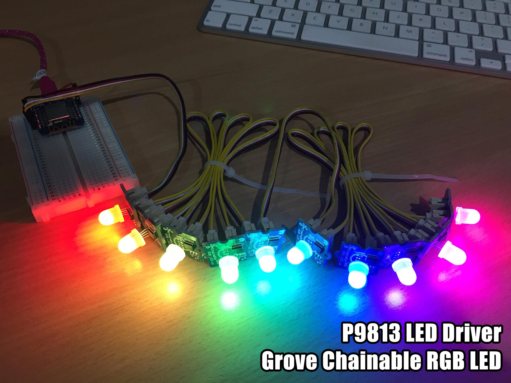

# MicroPython P9813

A MicroPython library for P9813 RGB LED drivers.

For example, the Seeed Studio [Grove - Chainable RGB LED](http://wiki.seeed.cc/Grove-Chainable_RGB_LED/).



## Example

Copy the file to your device, using ampy, webrepl or compiling and deploying. eg.

```
$ ampy put p9813.py
```

**Basic usage**

```
from machine import Pin
import p9813

pin_clk = Pin(5, Pin.OUT)
pin_data = Pin(4, Pin.OUT)

num_leds = 10
chain = p9813.P9813(pin_clk, pin_data, num_leds)

# set the first LED to red
chain[0] = (255, 0, 0)

# set the second LED to green
chain[1] = (0, 255, 0)

# write data to all LEDs
chain.write()

# make all LEDs red
chain.fill((255,0,0))
chain.write()

# turn off all LEDs
chain.reset()
```

See [p9813_examples.py](p9813_examples.py) and [examples](examples/) for more.

## Parts

* [WeMos D1 Mini](https://www.aliexpress.com/store/product/D1-mini-Mini-NodeMcu-4M-bytes-Lua-WIFI-Internet-of-Things-development-board-based-ESP8266/1331105_32529101036.html) $4.00 USD
* [Grove - Chainable RGB LED](https://www.seeedstudio.com/Grove-Chainable-RGB-LED-p-850.html) $3.90 USD
* [Grove Male Jumper Cable](https://www.seeedstudio.com/Grove-4-pin-Male-Jumper-to-Grove-4-pin-Conversion-Cable-%285-PCs-per-Pack%29-p-1565.html) $2.90 USD

## Connections

WeMos D1 Mini | Grove Chainable RGB LED
------------- | -----------------------
D1 (GPIO5)    | CI (clock) (yellow)
D2 (GPIO4)    | DI (data) (white)
3V3 (or 5V)   | VCC (red)
G             | GND (black)

If you are chaining multiple LEDs, clock out -> clock in, data out -> data in, eg.

LED1 | LED2
---- | ----
CO   | CI (yellow)
DO   | DI (white)
VCC  | VCC (red)
GND  | GND (black)

## Links

* [WeMos D1 Mini](https://wiki.wemos.cc/products:d1:d1_mini)
* [micropython.org](http://micropython.org)
* [Adafruit Ampy](https://learn.adafruit.com/micropython-basics-load-files-and-run-code/install-ampy)
* [P9813 datasheet](https://raw.githubusercontent.com/SeeedDocument/Grove-Chainable_RGB_LED/master/res/P9813_datasheet.pdf)